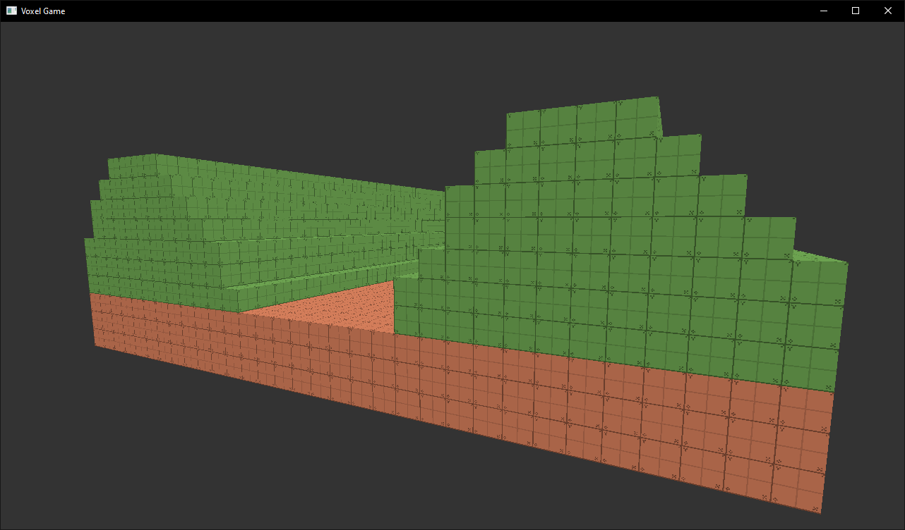


# Simple Voxel Engine
###### _Just **SVE**_

## Introduction

This is a voxel engine built using C++ and OpenGL. It allows for the creation of voxel-based games and simulations.

### To-Do List

- [x] Basic voxel rendering
- [X] Texture map support
- [x] Chunk management system
- [ ] Physics simulation
- [ ] Modularity
- [ ] Save/load functionality
- [ ] User interface
- [ ] Documentation

## Features

- **Voxel Rendering**: The engine supports efficient rendering of voxel worlds.
- **Chunk Management**: It handles the loading, unloading, and management of chunks to optimize performance.
- **Modularity**: The engine is designed to be modular, allowing for easy extension and customization.

## Dependencies
- glad
- GLFW
- GLM
- libpng
